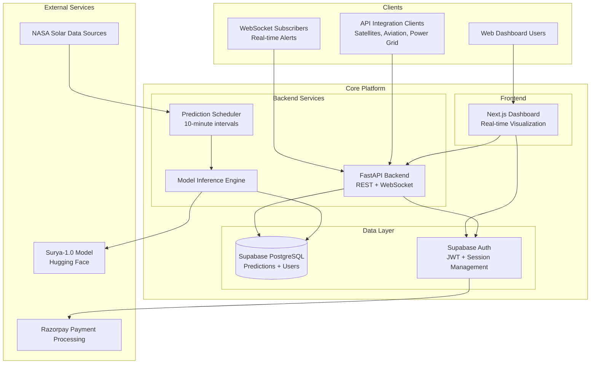
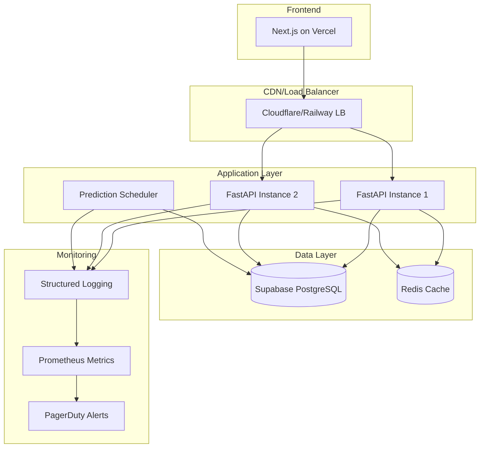

# Design Document

## Overview

ZERO-COMP is a real-time solar weather prediction platform that leverages NASA-IBM's Surya-1.0 transformer model to provide enterprise-grade solar flare forecasting. The system architecture follows a modern microservices approach with FastAPI backend, Supabase for data persistence and authentication, and Next.js frontend for dashboard visualization. The platform serves multiple customer tiers through REST APIs, WebSocket connections, and web dashboards.

## Architecture

### High-Level Architecture



### Technology Stack

- **Backend**: FastAPI (Python 3.9+) with Uvicorn ASGI server
- **Database**: Supabase (PostgreSQL) with real-time subscriptions
- **Authentication**: Supabase Auth with JWT tokens
- **ML Model**: NASA-IBM Surya-1.0 via Hugging Face Transformers
- **Frontend**: Next.js 14 with TypeScript and Tailwind CSS
- **Real-time**: WebSocket connections via FastAPI + Supabase Realtime
- **Payments**: Razorpay integration for subscription management
- **Deployment**: Railway/Fly.io (backend), Vercel (frontend)

## Components and Interfaces

### 1. Model Inference Engine

**Purpose**: Executes Surya-1.0 model predictions and processes solar weather data.

**Key Components**:
- `SuryaModelClient`: Wrapper for Hugging Face Transformers integration
- `PredictionProcessor`: Handles input preprocessing and output postprocessing
- `SeverityClassifier`: Converts probability scores to severity levels (low/medium/high)

**Interface**:
```python
class ModelInferenceEngine:
    async def run_prediction(self) -> PredictionResult
    async def classify_severity(self, probability: float) -> SeverityLevel
    async def validate_input_data(self, solar_data: SolarData) -> bool
```

### 2. FastAPI Backend Service

**Purpose**: Provides REST API endpoints and WebSocket connections for real-time alerts.

**Key Endpoints**:
- `GET /api/v1/alerts/current` - Current solar flare probability
- `GET /api/v1/alerts/history` - Historical predictions with filtering
- `WebSocket /ws/alerts` - Real-time alert streaming
- `POST /api/v1/webhooks/razorpay` - Razorpay webhook handling

**Interface**:
```python
class AlertsAPI:
    async def get_current_alert(self) -> AlertResponse
    async def get_alert_history(self, filters: AlertFilters) -> List[AlertResponse]
    async def stream_alerts(self, websocket: WebSocket) -> None
```

### 3. Supabase Data Layer

**Purpose**: Manages data persistence, user authentication, and real-time subscriptions.

**Database Schema**:
```sql
-- Predictions table
CREATE TABLE predictions (
    id UUID PRIMARY KEY DEFAULT gen_random_uuid(),
    timestamp TIMESTAMPTZ NOT NULL DEFAULT NOW(),
    flare_probability DECIMAL(5,4) NOT NULL,
    severity_level TEXT NOT NULL CHECK (severity_level IN ('low', 'medium', 'high')),
    model_version TEXT NOT NULL DEFAULT 'surya-1.0',
    raw_output JSONB,
    created_at TIMESTAMPTZ DEFAULT NOW()
);

-- User subscriptions
CREATE TABLE user_subscriptions (
    id UUID PRIMARY KEY DEFAULT gen_random_uuid(),
    user_id UUID REFERENCES auth.users(id),
    tier TEXT NOT NULL CHECK (tier IN ('free', 'pro', 'enterprise')),
    razorpay_subscription_id TEXT,
    api_key_hash TEXT UNIQUE,
    webhook_url TEXT,
    alert_thresholds JSONB,
    created_at TIMESTAMPTZ DEFAULT NOW(),
    updated_at TIMESTAMPTZ DEFAULT NOW()
);

-- API usage tracking
CREATE TABLE api_usage (
    id UUID PRIMARY KEY DEFAULT gen_random_uuid(),
    user_id UUID REFERENCES auth.users(id),
    endpoint TEXT NOT NULL,
    timestamp TIMESTAMPTZ DEFAULT NOW(),
    response_time_ms INTEGER,
    status_code INTEGER
);
```

### 4. Next.js Dashboard

**Purpose**: Provides web-based interface for monitoring solar weather and managing subscriptions.

**Key Components**:
- `AlertDashboard`: Real-time probability display and historical charts
- `SubscriptionManager`: Billing and plan management
- `APIKeyManager`: API key generation and management
- `WebhookConfig`: Webhook URL configuration for alerts

**Interface**:
```typescript
interface DashboardProps {
  currentAlert: AlertData;
  historicalData: AlertData[];
  userSubscription: SubscriptionData;
  realTimeConnection: WebSocket;
}
```

### 5. Prediction Scheduler

**Purpose**: Orchestrates regular model inference execution and result storage.

**Key Components**:
- `ScheduledExecutor`: Cron-based execution every 10 minutes
- `DataFetcher`: Retrieves latest solar data from NASA sources
- `ResultProcessor`: Stores predictions and triggers alerts

**Interface**:
```python
class PredictionScheduler:
    async def execute_prediction_cycle(self) -> None
    async def fetch_solar_data(self) -> SolarData
    async def store_prediction(self, result: PredictionResult) -> None
    async def trigger_alerts(self, result: PredictionResult) -> None
```

## Data Models

### Core Data Structures

```python
from pydantic import BaseModel
from datetime import datetime
from enum import Enum

class SeverityLevel(str, Enum):
    LOW = "low"
    MEDIUM = "medium" 
    HIGH = "high"

class PredictionResult(BaseModel):
    timestamp: datetime
    flare_probability: float  # 0.0 to 1.0
    severity_level: SeverityLevel
    confidence_score: float
    model_version: str = "surya-1.0"
    raw_output: dict

class AlertResponse(BaseModel):
    id: str
    timestamp: datetime
    flare_probability: float
    severity_level: SeverityLevel
    alert_triggered: bool
    message: str

class UserSubscription(BaseModel):
    user_id: str
    tier: str  # free, pro, enterprise
    api_key: str
    webhook_url: Optional[str]
    alert_thresholds: dict
    rate_limits: dict

class SolarData(BaseModel):
    timestamp: datetime
    magnetic_field_data: List[float]
    solar_wind_speed: float
    proton_density: float
    temperature: float
    source: str = "nasa"
```

### API Response Formats

```python
class CurrentAlertResponse(BaseModel):
    current_probability: float
    severity_level: SeverityLevel
    last_updated: datetime
    next_update: datetime
    alert_active: bool

class HistoricalAlertsResponse(BaseModel):
    alerts: List[AlertResponse]
    total_count: int
    page: int
    page_size: int
    has_more: bool

class WebSocketMessage(BaseModel):
    type: str  # "alert", "heartbeat", "error"
    data: dict
    timestamp: datetime
```

## Error Handling

### Error Classification

1. **Model Inference Errors**
   - Hugging Face API failures
   - Invalid input data format
   - Model timeout or memory issues

2. **Data Layer Errors**
   - Database connection failures
   - Authentication token expiration
   - Rate limit exceeded

3. **External Service Errors**
   - NASA data source unavailable
   - Razorpay webhook failures
   - Network connectivity issues

### Error Response Format

```python
class ErrorResponse(BaseModel):
    error_code: str
    message: str
    details: Optional[dict]
    timestamp: datetime
    request_id: str

# Example error responses
HTTP_ERRORS = {
    400: "Invalid request parameters",
    401: "Authentication required",
    403: "Insufficient subscription tier",
    429: "Rate limit exceeded",
    500: "Internal server error",
    503: "Service temporarily unavailable"
}
```

### Retry and Fallback Strategies

- **Model Inference**: 3 retries with exponential backoff
- **Database Operations**: Connection pooling with automatic failover
- **External APIs**: Circuit breaker pattern with 30-second timeout
- **WebSocket Connections**: Automatic reconnection with jitter

## Testing Strategy

### Unit Testing
- Model inference accuracy validation
- API endpoint response validation
- Database operation integrity
- Authentication flow verification

### Integration Testing
- End-to-end prediction pipeline
- WebSocket connection stability
- Razorpay webhook processing
- Real-time alert delivery

### Performance Testing
- API response time under load (< 200ms p95)
- WebSocket concurrent connection limits (1000+ connections)
- Database query optimization (< 50ms for historical queries)
- Model inference latency (< 30 seconds per prediction)

### Security Testing
- API key validation and rotation
- JWT token expiration handling
- Rate limiting effectiveness
- Input sanitization and validation

## Deployment Architecture

### Production Environment



### Scaling Considerations

- **Horizontal Scaling**: Multiple FastAPI instances behind load balancer
- **Database Scaling**: Supabase read replicas for historical data queries
- **Caching Strategy**: Redis for frequently accessed predictions
- **CDN**: Static assets and API responses cached at edge locations

### Monitoring and Observability

- **Application Metrics**: Request latency, error rates, prediction accuracy
- **Infrastructure Metrics**: CPU, memory, database connections
- **Business Metrics**: Active subscriptions, API usage, alert delivery success
- **Alerting**: PagerDuty integration for critical system failures