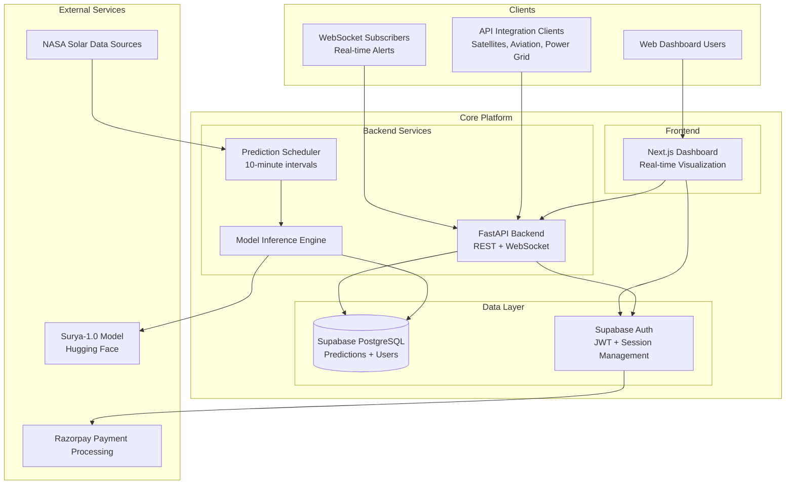

# 🏛️ System Architecture

The ZERO-COMP platform is designed with a modern, microservices-based architecture to ensure scalability, reliability, and maintainability.

## 💻 Technology Stack

- **Backend**: FastAPI (Python 3.9+) with Uvicorn ASGI server
- **Database**: Supabase (PostgreSQL) with real-time subscriptions
- **Authentication**: Supabase Auth with JWT tokens
- **ML Model**: NASA-IBM Surya-1.0 via Hugging Face Transformers
- **Frontend**: Next.js 14 with TypeScript and Tailwind CSS
- **Real-time**: WebSocket connections via FastAPI + Supabase Realtime
- **Payments**: Razorpay integration for subscription management
- **Deployment**: Railway/Fly.io (backend), Vercel (frontend)

## 📚 API and Database

### API Documentation

The API is self-documenting, thanks to FastAPI. Once the application is running, you can access the interactive API documentation at the following URLs:

- **Swagger UI:** [`http://localhost:8000/docs`](http://localhost:8000/docs)
- **ReDoc:** [`http://localhost:8000/redoc`](http://localhost:8000/redoc)

These interfaces provide detailed information about each endpoint, including request and response models, and allow you to interact with the API directly from your browser.

### Key API Endpoints

- `GET /health`: Health check for the API.
- `GET /api/v1/alerts/current`: Get the most recent solar flare prediction.
- `GET /api/v1/alerts/history`: Retrieve historical prediction data.
- `POST /api/v1/users/register`: Register a new user.
- `POST /api/v1/users/login`: Authenticate and receive a JWT.
- `WEBSOCKET /ws/alerts`: Establish a WebSocket connection for real-time alerts.

### Database Schema

The database schema is managed by Supabase and defined in the `database/` directory. The key tables are:

- **`predictions`**: Stores all solar flare predictions generated by the Surya-1.0 model.
- **`user_subscriptions`**: Manages user accounts, subscription tiers (`free`, `pro`, `enterprise`), and API keys.
- **`api_usage`**: Tracks API requests for analytics and rate-limiting purposes.
- **`alert_notifications`**: Logs all alerts (WebSocket, webhook, etc.) sent to users.
- **`system_metrics`**: Records system health and performance metrics.

For the complete schema, including indexes, policies, and views, please refer to the `database/schema.sql` file.
