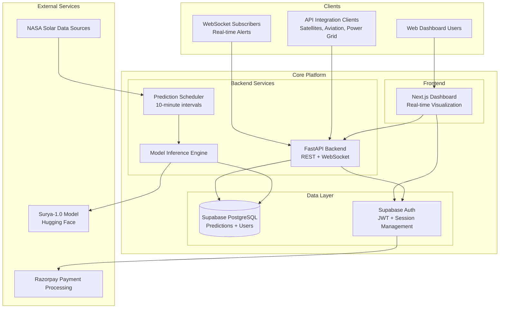

# ZERO-COMP Solar Weather API


**ZERO-COMP** is a real-time, enterprise-grade solar flare prediction API powered by NASA-IBM's groundbreaking **Surya-1.0** transformer model. This platform provides critical solar weather forecasting to industries dependent on space and atmospheric reliability, such as satellite operators, power grid companies, and aviation firms.

Our mission is to deliver actionable, high-accuracy solar weather intelligence through a robust and scalable platform. By offering tiered access via web dashboards, REST APIs, and real-time WebSocket alerts, ZERO-COMP empowers customers to mitigate operational risks, protect valuable assets, and ensure safety during significant solar events.

## ✨ Key Features

- **Real-Time Solar Flare Prediction:** Leverages the Surya-1.0 model to deliver solar flare predictions with updates every 10 minutes.
- **Multi-Tiered Access:** Offers `Free`, `Pro`, and `Enterprise` subscription tiers to cater to different user needs, from simple dashboard access to full API integration.
- **REST API:** A comprehensive REST API for accessing both current and historical solar flare prediction data.
- **WebSocket Alerts:** Real-time alert notifications for high-severity solar flare events, enabling immediate response.
- **Webhook Integration:** Support for webhook notifications to seamlessly integrate with your existing systems and workflows.
- **Historical Data Analysis:** Access to historical prediction data, with options for visualization and CSV export for enterprise users.
- **Reliable and Scalable:** Built with a modern, microservices-based architecture to ensure high availability and low latency, with a 99.9% uptime SLA for enterprise customers.
- **Developer-Friendly:** Interactive API documentation via Swagger UI and ReDoc, with consistent JSON response formats.
- **Secure:** Implements best practices for security, including JWT-based authentication, API key management, and rate limiting.

## 🏛️ System Architecture

The ZERO-COMP platform is designed with a modern, microservices-based architecture to ensure scalability, reliability, and maintainability.



## 💻 Technology Stack

- **Backend**: FastAPI (Python 3.9+) with Uvicorn ASGI server
- **Database**: Supabase (PostgreSQL) with real-time subscriptions
- **Authentication**: Supabase Auth with JWT tokens
- **ML Model**: NASA-IBM Surya-1.0 via Hugging Face Transformers
- **Frontend**: Next.js 14 with TypeScript and Tailwind CSS
- **Real-time**: WebSocket connections via FastAPI + Supabase Realtime
- **Payments**: Razorpay integration for subscription management
- **Deployment**: Railway/Fly.io (backend), Vercel (frontend)

## 🚀 Getting Started

This guide will walk you through setting up the ZERO-COMP Solar Weather API on your local machine for development and testing.

### Prerequisites

Before you begin, ensure you have the following installed:
- [Python](https://www.python.org/downloads/) (version 3.9 or higher)
- [pip](https://pip.pypa.io/en/stable/installation/) (Python package installer)
- [Git](https://git-scm.com/downloads/) (for cloning the repository)
- An account with [Supabase](https://supabase.com/) for database and authentication services.

### Installation

1.  **Clone the repository:**
    ```bash
    git clone https://github.com/your-username/your-repo.git
    cd your-repo
    ```

2.  **Create a virtual environment (recommended):**
    ```bash
    python -m venv venv
    source venv/bin/activate  # On Windows, use `venv\Scripts\activate`
    ```

3.  **Install the dependencies:**
    ```bash
    pip install -r requirements.txt
    ```

### Configuration

The application uses environment variables for configuration. These variables are loaded from a `.env` file.

1.  **Create a `.env` file:**
    Copy the example environment file to create your own local configuration:
    ```bash
    cp .env.example .env
    ```

2.  **Update the environment variables:**
    Open the `.env` file in your editor and replace the placeholder values with your actual configuration. The most critical variables to set up are:
    - `SUPABASE_URL`: Your Supabase project URL.
    - `SUPABASE_ANON_KEY`: Your Supabase project's anonymous key.
    - `SUPABASE_SERVICE_KEY`: Your Supabase project's service role key.
    - `DATABASE_URL`: The connection string for your Supabase PostgreSQL database.
    - `JWT_SECRET`: A strong, secret key for signing JWTs.
    - `HUGGINGFACE_TOKEN`: Your Hugging Face access token for downloading the Surya-1.0 model.
    - `RAZORPAY_KEY_ID` and `RAZORPAY_KEY_SECRET`: If you intend to test payment processing.

## ▶️ Usage

Once you have completed the installation and configuration steps, you can run the application and perform tests.

### Running the Application

To start the development server, run the following command from the root of the project directory:

```bash
uvicorn app.main:app --host 0.0.0.0 --port 8000 --reload
```

The API will be available at `http://localhost:8000`.

### Running Tests

This project uses `pytest` for testing. To run the full test suite, use the following command:

```bash
pytest
```

Ensure you have a separate test database or have configured your environment appropriately to run tests without affecting your development data.

## 📚 API and Database

### API Documentation

The API is self-documenting, thanks to FastAPI. Once the application is running, you can access the interactive API documentation at the following URLs:

- **Swagger UI:** [`http://localhost:8000/docs`](http://localhost:8000/docs)
- **ReDoc:** [`http://localhost:8000/redoc`](http://localhost:8000/redoc)

These interfaces provide detailed information about each endpoint, including request and response models, and allow you to interact with the API directly from your browser.

### Key API Endpoints

- `GET /health`: Health check for the API.
- `GET /api/v1/alerts/current`: Get the most recent solar flare prediction.
- `GET /api/v1/alerts/history`: Retrieve historical prediction data.
- `POST /api/v1/users/register`: Register a new user.
- `POST /api/v1/users/login`: Authenticate and receive a JWT.
- `WEBSOCKET /ws/alerts`: Establish a WebSocket connection for real-time alerts.

### Database Schema

The database schema is managed by Supabase and defined in the `database/` directory. The key tables are:

- **`predictions`**: Stores all solar flare predictions generated by the Surya-1.0 model.
- **`user_subscriptions`**: Manages user accounts, subscription tiers (`free`, `pro`, `enterprise`), and API keys.
- **`api_usage`**: Tracks API requests for analytics and rate-limiting purposes.
- **`alert_notifications`**: Logs all alerts (WebSocket, webhook, etc.) sent to users.
- **`system_metrics`**: Records system health and performance metrics.

For the complete schema, including indexes, policies, and views, please refer to the `database/schema.sql` file.

## 🤝 Contributing

Contributions are welcome! If you have a suggestion or find a bug, please open an issue to discuss it.

If you would like to contribute code, please follow these steps:
1.  Fork the repository.
2.  Create a new branch (`git checkout -b feature/your-feature-name`).
3.  Make your changes.
4.  Commit your changes (`git commit -m 'Add some feature'`).
5.  Push to the branch (`git push origin feature/your-feature-name`).
6.  Open a pull request.

## 📄 License

This project is licensed under the MIT License. See the `LICENSE` file for details.